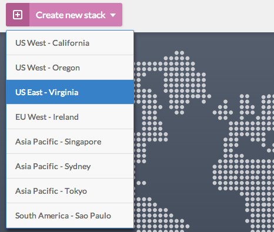
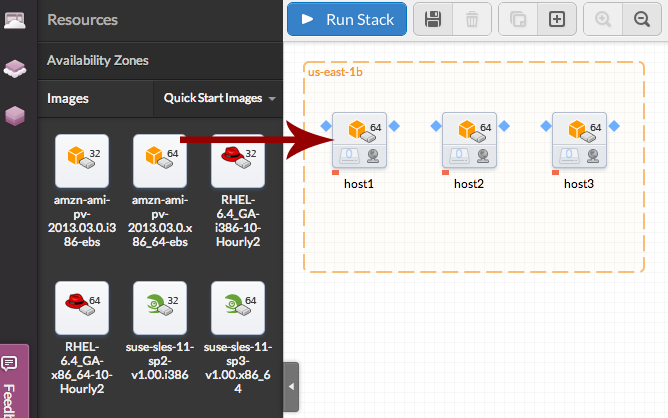
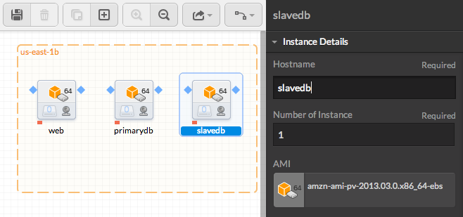

<h1>Wiki HTML5</h1>
<h2>Getting Started: Normal Mode</h2>
<h3>1. Overview</h3>
MadeiraCloud groups your resources and manages them as a single unit, either an “App” or a “Stack”. The concept is similar to VMware's vApp and OVF:

- A stack is a template of an application containing everything that's needed to run it, e.g., code, servers, storage, network configuration, etc., but in a static, re-usable form.
- An app is a live instance of a stack. When launching a stack, all of its component resources will be provisioned and configured as specified in the stack to create a running version as an app. Apps can be monitored and managed as one entity, making backups easy.

Put simply, an app is everything to do with a running setup and a stack is like a snapshot or image of an entire app. Stacks are reusable so they can be launched into multiple apps which will then each have their own unique component resources with no conflicts.

<h3>2. Connecting MadeiraCloud and AWS</h3>
An Amazon Web Services account is required in order to get full functionality from MadeiraCloud.

<h4>2.1 Prerequisites</h4>
- If you haven't already, please <a href="http://aws.amazon.com/">sign up for an AWS account</a> (EC2 is mandatory).
- And obviously, a Madeira account is also required. You can sign up for a <a href="https://my.madeiracloud.com/user/register">free account here</a>.

<h4>2.2 Entering your Credentials</h4>
The next step is to let us know your AWS account credentials in order for MadeiraCloud to connect with AWS on your behalf.

Go to your <a href="https://my.madeiracloud.com/user/me/edit/AWS">AWS Credentials</a> page on MadeiraCloud and you will be prompted with the following:

You can find your AWS credentials by clicking <a href="https://aws-portal.amazon.com/gp/aws/securityCredentials">here</a> or selecting 'Security Credentials' from the 'My Account/Console' menu:

After logging in, you can find your Account Number in the top right of the page, just under your username:

This is optional, but is needed for some advanced features such as sharing an EC2 AMI or EBS snapshot with other users.

Your Access Key and Secret Access Key can be found on the same page, under access credentials:

This is required in order for us to use AWS' Rest APIs to let you manage your AWS account through our application.

Just copy and paste these three pieces of information in to your Madeira AWS page, hit save and you are done.

<h3>2b. Connecting MadeiraCloud and AWS using IAM</h3>
<h4>Make sure IAM access is enabled.</h4>
Log in to your AWS account and then go <a href="https://aws-portal.amazon.com/gp/aws/manageYourAccount">here</a>.

Scroll down to the IAM user access section and make sure both the 'Account Activity Page' and 'Usage Reports Page' checkboxes are ticked and then click Activate Now.

<h4>Create a user for use with MadeiraCloud.</h4>
Go to the AWS Console and click the <a href="https://console.aws.amazon.com/iam/home">IAM tab</a>, then create a group for your user. You can call it anything you like, but something Madeira related probably makes sense!

Click 'Select' after 'Amazon EC2 Full Access'.

Here you can review the permissions. If you are happy, click 'Continue'.

Then click the 'Create New Users' tab and enter a name for the new user. Leave 'Generate an access key for each User' ticked and then click 'Continue'.

Review your settings and click 'Finish'.

The IAM account has now been created. Click 'Show User Security Credentials'.

You can now see the Access Key ID and Secret Access Key for this user.

Copy and paste these into your Madeira <a href="https://my.madeiracloud.com/user/me/edit/AWS">AWS Credentials</a> page and click 'Save' and you're done!

<h3 style="color: red;">3. Designing a simple stack (Drupal MySQL HA example)</h3>
For this example, we're going to create a simple stack for quickly deploying a Drupal CMS site with MySQL master and slave databases.

1. Log in to the <a href="https://ide.madeiracloud.com/v2/">IDE</a>
2. Create a new stacke by clicking "Create new stack" on the top left of the IDE dashboard
3. Choose the <a href="http://aws.amazon.com/about-aws/globalinfrastructure/regional-product-services/">AWS region</a> where you want to create your stack 

4. Select "Classic" in the following menu (see <a href="" style="color: red;">VPC mode - Part xxx</a> for VPC) 

5. From the resource panel on the left, select the <a href="http://docs.aws.amazon.com/AWSEC2/latest/UserGuide/using-regions-availability-zones.html">Availability Zone</a> of your choice and drag'n'drop it to the canvas (Note: Availability Zones depend on regions) 

6. Following the same principle, drag'n'drop 3 instances ('Images' menu) inside the previously created Availability Zone (Note: We will use 64bits Amazon Linux AMIs in this example) 

7. Click on each AMI icon and set the hostnames to the following in the right pannel 

<h3>4. Setting up your application (Drupal MySQL HA example)</h3>
After following the steps in <a href="" style="color:red;">Part 3 - Designing a simple stack</a>, your application is now running, and you have downloaded the KeyPair for the application.

You will now need to SSH into the web instance.
You can use any terminal client to do so. If you are running under Windows, which doesn't have any SSH compatible terminal embedded, we recomment PuTTY. In this case, you will also need to know how to <a href="http://docs.aws.amazon.com/AWSEC2/latest/UserGuide/putty.html?r=madeira">connect to Linux/UNIX Instances from PuTTY</a>.

<h4>Disclamer</h4>
Please, be aware that these steps are purely informative and may differs (more, or less) from the reality, due to anyone's configuration.

We can't provide any warranty or support if you face issues during this phase, then be sure of what you are doing while setting up your applications.

<h4>Setting up the instances</h4>
In this example, all the instances are running Amazon Linux, so write:

- `curl -s http://download.madeiracloud.com/setup/amazon.sh | sh"`

to the terminal for each instance as the root user.

<h4>Deploying Drupal</h4>
SSH into the 'web' instance and write the following commands in order to install Drupal:

1. `sudo su -`
2. `yum install -y httpd php php-gd php-mysql php-xml php-mbstring mysql`
3. `chkconfig httpd on`
4. `cd /var/www/html/`
5. `wget http://ftp.drupal.org/files/projects/drupal-x.xx.tar.gz` (replace `x.xx` with the latest version number from the <a href="http://drupal.org/project/drupal">Drupal site</a>.)
6. `tar xzf drupal-x.xx.tar.gz` (replace `x.xx` by your version number)
7. `rm drupal-x.xx.tar.gz` (then type `y` to confirm)
8. `mv drupal-x.xx/* .`
9. `rm -rf drupal-x.xx/`
10. `mkdir -p /var/www/html/sites/default/files`
11. `cp sites/default/default.settings.php sites/default/settings.php`
12. `chmod 757 -R /var/www/html/sites/default/files`
13. `chmod 646 /var/www/html/sites/default/settings.php`
14. `service httpd start`

<h4>Configure the primarydb</h4>
SSH into the 'primarydb' instance and write the following commands in order to configure the databases:

1. `sudo su -`
2. `chkconfig mysqld on`
3. `service mysqld start`
4. `/usr/bin/mysqladmin -u root password xxx` (replace `xxx` with a secure password of your choice)
5. `mysql -u root -p` (then enter your password and press enter)
6. `GRANT ALL ON *.* TO root@'%' IDENTIFIED BY 'letmein' WITH GRANT OPTION;`
7. `FLUSH PRIVILEGES;`
8. `CREATE DATABASE drupal;` (or replace `drupal` with a database name of your choice)

<h4>Setting up Drupal</h4>
Open your browser and access: http://{web-public-hostname}:

1. Select the type of installation you would like and click `Save and Continue`
2. Select a language and click `Save and Continue`
3. Leave `Database type` as `MySQL, MariaDB, or equivalent`
4. Enter the name you entered earlier for `Database name`, e.g., `drupal`
5. For `Database username` enter `root`
6. For `Database password` enter the password you entered earlier, e.g., `xxx`
7. Click to expand `ADVANCED OPTIONS`
8. For `Database host` enter `primarydb`
9. For `Database port` enter `3306` and click `Save and Continue`
10. Complete the remainder of the Drupal wizard

<h4>Setting up MySQL HA</h4>
SSH into primarydb and write the following commands:

1. `sudo su -`
2. `mysql -u root -p` (then enter password and hit enter)
3. `GRANT REPLICATION SLAVE, REPLICATION CLIENT ON *.* TO root@'slave_db' IDENTIFIED BY 'xxx';` (replace `xxx` by your mysql password)
4. `FLUSH PRIVILEGES;` (Then press Ctrl-C to quit MySQL)
5. `nano /etc/my.cnf` (or use the editor of your choice, as `vi` or `emacs`)
6. at the end of the first block, after `symbolic-links=0` and before `[mysqld_safe]` paste the following: <pre>log-bin = mysql-bin server-id = 1</pre>then save and quit (Ctrl-X)
7. `/etc/init.d/mysqld restart`

Now SSH into slavedb and write the following commands:

1. `sudo su -`
2. `nano /etc/my.cnf`
3. at the end of the first block, after `symbolic-links=0` and before `[mysqld_safe]` paste the following): <pre>log-bin = mysql-bin server-id = 2 relay-log = mysql-relay-bin log-slave-updates = 1 read-only = 1</pre>
4. `/etc/init.d/mysqld restart`

And back to primarydb:

1. `mysqldump -u root -p --all-databases --master-data=2 > dump.db`
2. Copy this file to the slave_db instance

And back to slavedb:

1. Go to the directory you copied `dump.db`
2. `/etc/init.d/mysqld restart`
3. `mysql -u root`
4. `GRANT ALL ON *.* TO root@'%' IDENTIFIED BY 'letmein' WITH GRANT OPTION;`
5. `FLUSH PRIVILEGES;` (Then press Ctrl-C to quit MySQL)
6. `mysql -u root < dump.db`
7. `mysql -u root`
8. Now you need to open your local copy of `dump.db` and search for `MASTER_LOG_FILE` and `MASTER_LOG_POS`, noting their values and replacing them in the following line:
`CHANGE MASTER TO master_host='primarydb', master_user='root', master_password='letmein', master_log_file='mysql-bin.000001', master_log_pos=106;`
9. `START SLAVE;`