# Part 1 - Basics and quick start
## 1. Overview
MadeiraCloud groups your resources and manages them as a single unit, either an “App” or a “Stack”. The concept is similar to VMware's vApp and OVF:

- A Stack is a template of an application containing everything that's needed to run it, e.g., code, servers, storage, network and servers configuration, etc., but in a static, re-usable form.
- An App is a live instance of a Stack. When launching a Stack, all of its component resources will be provisioned and configured as specified in the Stack to create a running version as an App. Apps can be monitored and managed as one entity, making backups easy.

Put simply, an App is everything to do with a running setup and a Stack is like a snapshot or image of an entire App. Stacks are reusable so they can be launched into multiple apps which will then each have their own unique component resources with no conflicts.

## 2. Connecting MadeiraCloud and AWS
An Amazon Web Services account is required in order to get full functionality from MadeiraCloud.

### 2.1 - Prerequisites
- If you haven't already, please [sign up for an AWS account](http://aws.amazon.com/) (EC2 is mandatory).
- And obviously, a Madeira account is also required. You can sign up for a [free account here](https://ide.madeiracloud.com/register/).

### 2.2 - Entering your Credentials
The next step is to let us know your AWS account credentials in order for MadeiraCloud to connect with AWS on your behalf.

You should be promped at your first connection to [MadeiraCloud IDE](https://ide.madeiracloud.com/). If not, or if you want to update your credentials, login to [MadeiraCloud IDE](https://ide.madeiracloud.com/login/), then click on your username on the top-right corner => "Settings" => "AWS Credential" => "Update".

You can find your AWS credentials by clicking [here](https://aws-portal.amazon.com/gp/aws/securityCredentials).

After logging in, you can find your Account Number in the top right of the page, just under your username:

This is optional, but is needed for some advanced features such as sharing an EC2 AMI or EBS snapshot with other users.

Your Access Key and Secret Access Key can be found on the same page, under access credentials:

This is required in order for us to use AWS' Rest APIs to let you manage your AWS account through our application.

Just copy and paste these three pieces of information in to your Madeira AWS page, hit save and you are done.

## 2b. Connecting MadeiraCloud and AWS using IAM
### 2b.1 - Make sure IAM access is enabled.
Log in to your AWS account and then go [here](https://aws-portal.amazon.com/gp/aws/manageYourAccount).

Scroll down to the IAM user access section and make sure both the 'Account Activity Page' and 'Usage Reports Page' checkboxes are ticked and then click Activate Now.

### 2b.2 - Create a user for use with MadeiraCloud.
Go to the AWS Console and click the [IAM tab](https://console.aws.amazon.com/iam/home), then create a group for your user. You can call it anything you like, but something Madeira related probably makes sense!

Click 'Select' after 'Amazon EC2 Full Access'.

Here you can review the permissions. If you are happy, click 'Continue'.

Then click the 'Create New Users' tab and enter a name for the new user. Leave 'Generate an access key for each User' ticked and then click 'Continue'.

Review your settings and click 'Finish'.

The IAM account has now been created. Click 'Show User Security Credentials'.

You can now see the Access Key ID and Secret Access Key for this user.

Copy and paste these into your Madeira [AWS Credentials](https://my.madeiracloud.com/user/me/edit/AWS) page and click 'Save' and you're done!

## 3. Create a simple Application (Drupal-MySQL example)
For this example, we're going to create a simple Stack for quickly deploying a Drupal CMS site with MySQL master and slave databases.

### 3.1 - Design your stack
1. Log in to the [IDE](https://ide.madeiracloud.com/)
2. Create a new Stack by clicking "Create new Stack" on the top left of the IDE dashboard
3. Choose the [AWS region](http://aws.amazon.com/about-aws/globalinfrastructure/regional-product-services/) where you want to create your Stack 

4. From the resource panel on the left, select the [Availability Zone](http://docs.aws.amazon.com/AWSEC2/latest/UserGuide/using-regions-availability-zones.html) of your choice and drag'n'drop it to the canvas (Note: Availability Zones depend on regions) 
note: A subnet will automatically be created. If not, you can find subnets under "Virtual Private Cloud" category in the resources pannel. Simply drag it from the resoruce pannel and trp it inside the Availability Zone. 
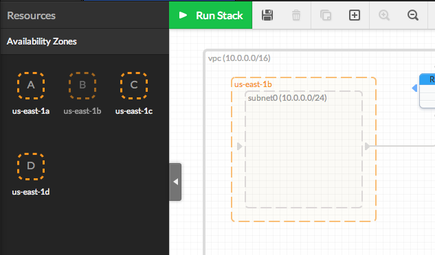
5. Add an "Internet Gateway" to your stack by dragging it from the "Virtual Private Cloud" category under the resources pannel to the edge of the VPC. Once done, you can connect the Internet Gateway to the default Route Table. 
The Internet Gateway will allow you to connect your VPC to the Internet. 

6. Following the same principle, drag'n'drop 2 instances ("Images" menu) inside the previously created Subnet (within the Availability Zone) (Note: We will use 64bits Amazon Linux AMIs in this example) 
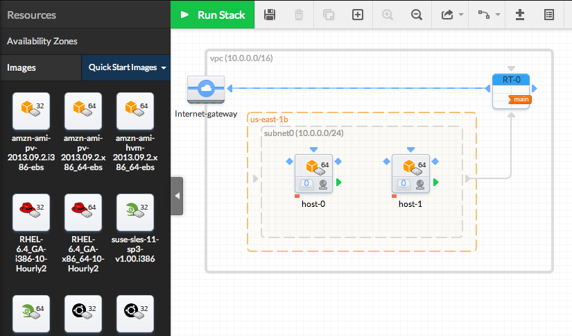
7. Click on each AMI icon and set the hostnames to the following in the right pannel 

8. Associate an EIP to the web (front-end) instance. Pay attention to keep them associated until the execution of the Stack (the icon should be colored) 
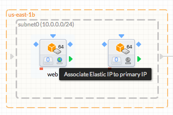
9. Assign a Public IP to mysql (backend) instances. Public IPs are necessary to access the Internet (or you need to manually configure a NAT instance in your VPC, used as gateway). 
To add a Public IP, on the right Property Pannel, tick "Automatically assign Public IP" int the "Network Interface Details" menu 
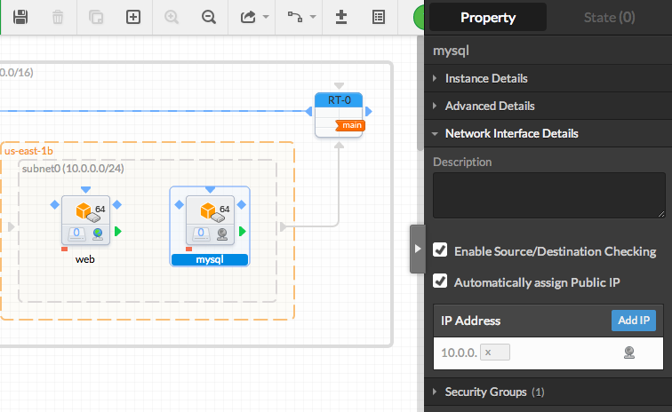
10. Define two [Security Groups](http://docs.aws.amazon.com/AWSEC2/latest/UserGuide/using-network-security.html), one for the front-end web server and one for the back-end database server  
Click on the web instance and then "Create new Security Group" in the "Security Groups" menu in the right pannel: 
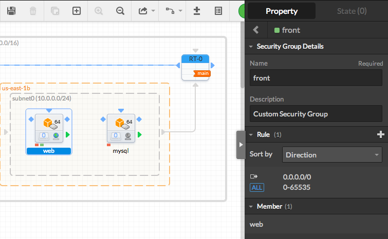 
Name this Security Group "front": 
 
Go back and assign the web instance to "front", then remove it from the default Security Group: 
 
Repeat the same operation to create a new "back" Security Group: 
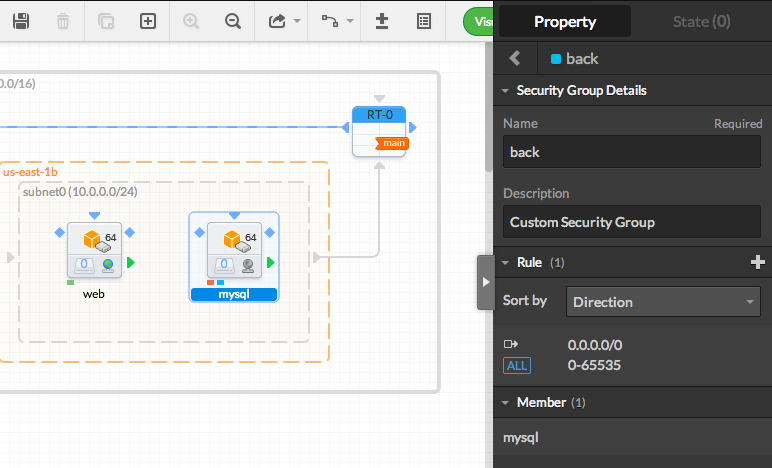 
Then add the two "mysql" and "slavedb" instances "back" Security Group, removing it from the default SG. 
 
11. Create the Security Rules to link the instances together  
Click on the mysql instance, then in the "Security Groups" menu in the right pannel, click on the right arrow on the right of the "back" SG to access its properties. 
In this menu, click on the "+" button to add a new rule. 
 
Start by adding a first rule allowing [SSH](http://www.openssh.org/) incoming connections to your instance (allow connections from the web instance on port 22, following TCP protocol, inbound) for remote management (note: the source(s) IP(s)/range must follow the [CIDR](http://en.wikipedia.org/wiki/Classless_Inter-Domain_Routing) notation). 
 
Add a new rule to allow SQL connections from the "front" Security Group (port 3306, TCP). 
 
Following the same method, you may want to add a new rule to allow all TCP traffic between all the instances of this Security Group (ports 1-65535 for example), in case you add new instances to this security group. You may as well want to allow all UDP and ICMP traffic. 
You should at least have the following rules: 
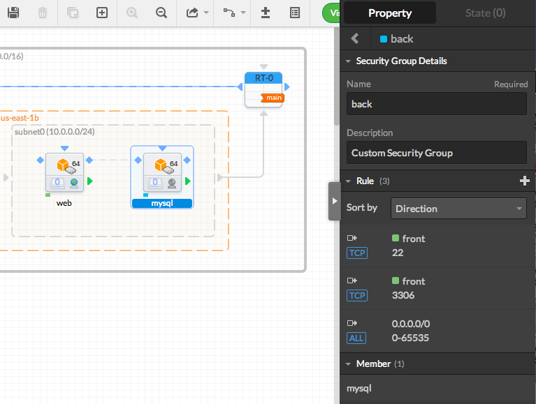 
Note that an outgoing rule to all ports, on all protocols is added by default. Although it is fine to keep it for this exmpla, it may be a good ide to make some more restricitve rules on a production stack.  
Repeat the same operation for the "front" Security Group, in order to get the following rules. 
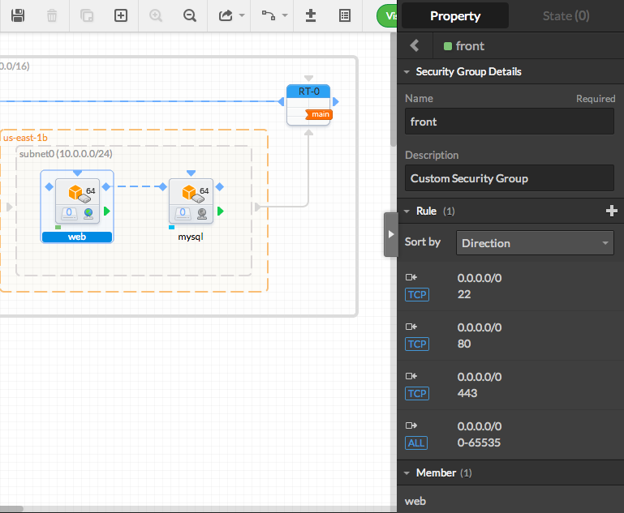  
12. Click on the blank area of the canvas to put the focus on the Stack properties. Name the Stack as "drupal-mysql" in the right pannel, then click on the save icon on the left side of the top bar. 
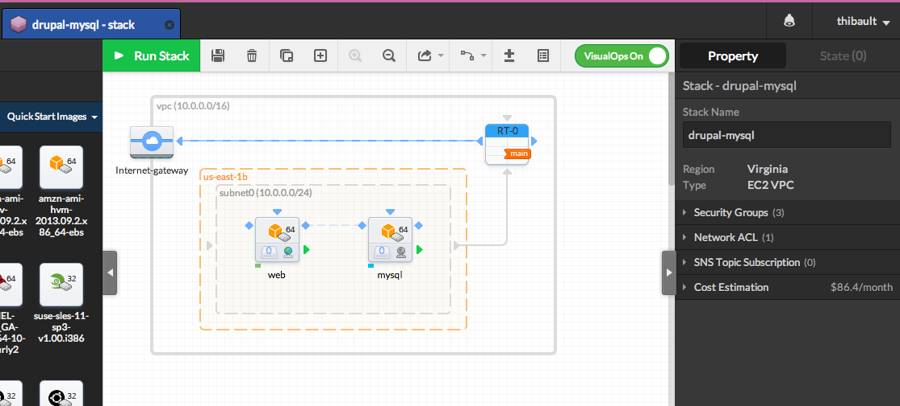 
Congratulations! Your Stack is now set and ready to be launched!  

### 3.2 - Configure your servers using VisualOps' states editor
After following the steps in [3.1 - Design your Stack](#design-your-stack), all the elements of your stack has been placed and the stack is ready to get started.

However, VisualOps' states editor now allows you to configure the software configuration of your instances directly from the IDE, even before starting the App.

##### Disclamer
Please, be aware that these steps are informative, given as an example, and may differ (more, or less) from the reality, due to anyone's configuration.

We can't provide any warranty or support if you face issues during this phase, then be sure of what you are doing while setting up your applications.

However, we would be happy to discuss with you the issues that you may face during the states configuration.

#### 3.2.1 - Precisions concerning VisualOps
When activating visualops, an agent will be installed on your instances, in order to render the recipes. The code of the agent is open-source, and can be seen at [here]().

Note that the agent is directly deployed from the tarballs present on the "release" directory on this repo. These tarballs are automatically regerated after every release, and the agent will be automatically updated on your instances.

VisualOps will be setup in the following directories on your instances:

- `/opt/madeira` source code and virtual environment
- `/var/lib/madeira` generated files and scripts
- `/etc/opsagent.conf` generated config file

In order to initialise the agent, MadeiraCloud IDE will use the [userdata](http://docs.aws.amazon.com/AWSEC2/latest/UserGuide/AESDG-chapter-instancedata.html) so start the bootstrap sequence, generating a system cron script (your `/etc/crontab` file will be edited).

Please, take care to not manually edit any of the files located under these emplacements.

The states modules are directly fetch from the [this]() repository, and stored under `/var/lib/madeira/bootstrap/salt`.

#### 3.2.2 - Activate VisualOps on the stack
To be able to use VisualOps on a stack, you need to activate VisualOps.

To do so, ensure the switch on the top-right of the central canevas is turned on (green color).

#### 3.2.3 - Instances configuration
To access the state editor, click on the instance you want to edit the states, then select the "State" tab on the right pannel.

Click on "Add a State" to add the first state. Here is the list of the states you may want to write to setup your Application.

##### Web instance

##### Mysql instance

#### Setting up the instances
In this example, all the instances are running Amazon Linux, so write:

- `curl -s http://download.madeiracloud.com/setup/amazon.sh | sh"`

to the terminal for each instance as the root user.

#### Deploying Drupal
SSH into the 'web' instance and write the following commands in order to install Drupal:

1. `sudo su -`
2. `yum install -y httpd php php-gd php-mysql php-xml php-mbstring mysql`
3. `chkconfig httpd on`
4. `cd /var/www/html/`
5. `wget http://ftp.drupal.org/files/projects/drupal-x.xx.tar.gz` (replace `x.xx` with the latest version number from the [Drupal site](http://drupal.org/project/drupal).)
6. `tar xzf drupal-x.xx.tar.gz` (replace `x.xx` by your version number)
7. `rm drupal-x.xx.tar.gz` (then type `y` to confirm)
8. `mv drupal-x.xx/* .`
9. `rm -rf drupal-x.xx/`
10. `mkdir -p /var/www/html/sites/default/files`
11. `cp sites/default/default.settings.php sites/default/settings.php`
12. `chmod 757 -R /var/www/html/sites/default/files`
13. `chmod 646 /var/www/html/sites/default/settings.php`
14. `service httpd start`

#### Configure the primarydb
SSH into the 'primarydb' instance and write the following commands in order to configure the databases:

1. `sudo su -`
2. `chkconfig mysqld on`
3. `service mysqld start`
4. `/usr/bin/mysqladmin -u root password xxx` (replace `xxx` with a secure password of your choice)
5. `mysql -u root -p` (then enter your password and press enter)
6. `GRANT ALL ON *.* TO root@'%' IDENTIFIED BY 'letmein' WITH GRANT OPTION;`
7. `FLUSH PRIVILEGES;`
8. `CREATE DATABASE drupal;` (or replace `drupal` with a database name of your choice)

#### Setting up Drupal
Open your browser and access: `http://{web-public-hostname}`:

1. Select the type of installation you would like and click `Save and Continue`
2. Select a language and click `Save and Continue`
3. Leave `Database type` as `MySQL, MariaDB, or equivalent`
4. Enter the name you entered earlier for `Database name`, e.g., `drupal`
5. For `Database username` enter `root`
6. For `Database password` enter the password you entered earlier, e.g., `xxx`
7. Click to expand `ADVANCED OPTIONS`
8. For `Database host` enter `primarydb`
9. For `Database port` enter `3306` and click `Save and Continue`
10. Complete the remainder of the Drupal wizard

#### Setting up MySQL HA
SSH into primarydb and write the following commands:

1. `sudo su -`
2. `mysql -u root -p` (then enter password and hit enter)
3. `GRANT REPLICATION SLAVE, REPLICATION CLIENT ON *.* TO root@'slave_db' IDENTIFIED BY 'xxx';` (replace `xxx` by your mysql password)
4. `FLUSH PRIVILEGES;` (Then press Ctrl-C to quit MySQL)
5. `nano /etc/my.cnf` (or use the editor of your choice, as `vi` or `emacs`)
6. at the end of the first block, after `symbolic-links=0` and before `[mysqld_safe]` paste the following: <pre>log-bin = mysql-bin server-id = 1</pre>then save and quit (Ctrl-X)
7. `/etc/init.d/mysqld restart`

Now SSH into slavedb and write the following commands:

1. `sudo su -`
2. `nano /etc/my.cnf`
3. at the end of the first block, after `symbolic-links=0` and before `[mysqld_safe]` paste the following): <pre>log-bin = mysql-bin server-id = 2 relay-log = mysql-relay-bin log-slave-updates = 1 read-only = 1</pre>
4. `/etc/init.d/mysqld restart`

And back to primarydb:

1. `mysqldump -u root -p --all-databases --master-data=2 > dump.db`
2. Copy this file to the slave_db instance

And back to slavedb:

1. Go to the directory you copied `dump.db`
2. `/etc/init.d/mysqld restart`
3. `mysql -u root`
4. `GRANT ALL ON *.* TO root@'%' IDENTIFIED BY 'letmein' WITH GRANT OPTION;`
5. `FLUSH PRIVILEGES;` (Then press Ctrl-C to quit MySQL)
6. `mysql -u root < dump.db`
7. `mysql -u root`
8. Now you need to open your local copy of `dump.db` and search for `MASTER_LOG_FILE` and `MASTER_LOG_POS`, noting their values and replacing them in the following line:
`CHANGE MASTER TO master_host='primarydb', master_user='root', master_password='letmein', master_log_file='mysql-bin.000001', master_log_pos=106;`
9. `START SLAVE;`

### 3.3 - Start your Application
1. Launch the Stack by clicking on the "Run Stack" button. 
 
2. Name the App in the pop-up window, then click on "Run Stack". Note that you can define here the type of your application (production option brings some optimisations as well as protections), and get a quick review of your app (potential and actual mistakes or advices, as well as the global cost). 
 
3. Wait until the App to be launched. 
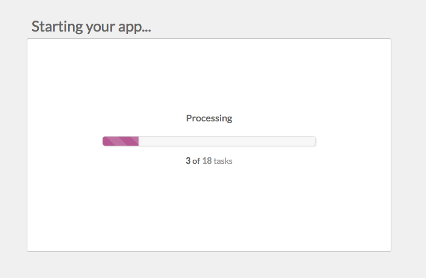 
4. Once started, your App should looks like the following: 
 
5. Click on the web instance to get the instance properties. You can see here all details concerning the running instance on the right pannel. We will pay attention here to the "Primary Public IP" and the "Key Pair". 
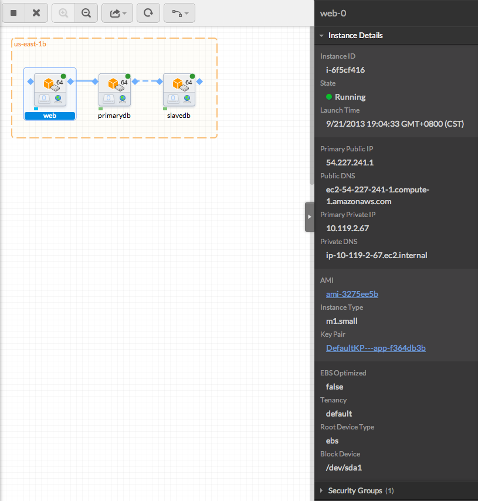 
6. You can now click on the link under "Key Pair" ("DefaultKP---app-f364db3b" here) to download the key file and get the standard SSH connection command. 
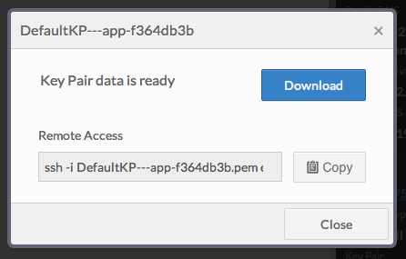 
