# Part 2 - VPCs in depth
## 1. Overview of VPC and AWS Platforms
A Virtual Private Cloud (or VPC) is a virtual network of logically isolated EC2 instances and an optional VPN connection to your own datacenter. This allows greater security than the classic EC2 system. Amazon announced that they are changing to VPC by default to all new users on a region by region basis. Thus, we decided to support only VPC based applications.

Lear more about VPCs and the abandon of EC2-Classic [here]().

## 2. Step-by-step tutorials
The following stacks are prebuilt by default when you create your Madeira account. The following example are made to help for their understanding within MadeiraCloud IDE.

### 2.1 - VPC with a Public Subnet Only
[Description](http://docs.aws.amazon.com/AmazonVPC/latest/UserGuide/VPC_Scenario1.html): "The configuration for this scenario includes a virtual private cloud (VPC) with a single public subnet, and an Internet gateway to enable communication over the Internet. We recommend this configuration if you need to run a single-tier, public-facing web application, such as a blog or a simple website."

The following diagram shows what we will create in this example: 
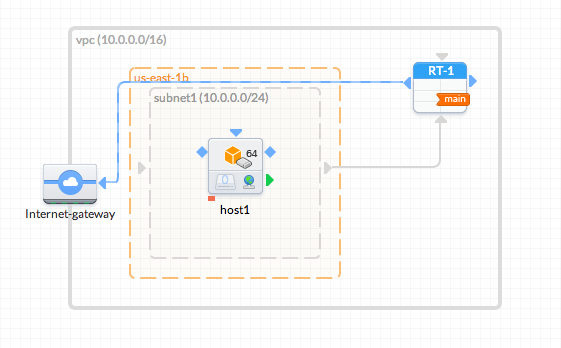 

Step by Step guide to configuring a VPC with a Public Subnet (you may want to have a look at [Part 1 - Basics and quick start](#basics-and-quick-start) first, before reading this tutorial).

1. Create a new VPC Stack, in the region of your choice: 
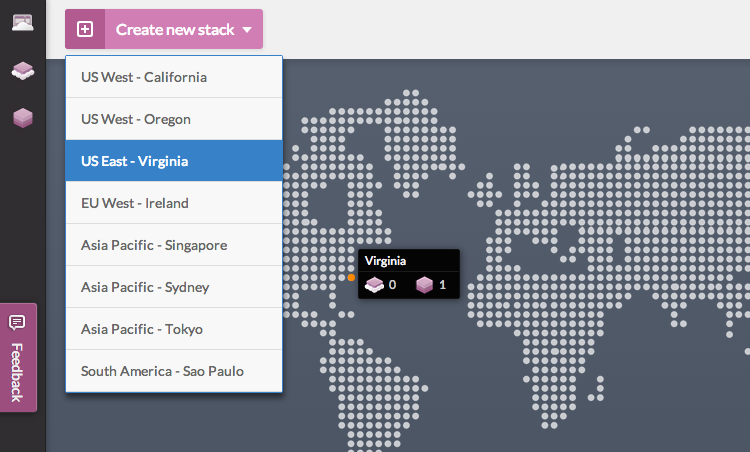 
2. A default VPC is created when you create a new VPC Stack, as well as a default [Route Table](http://docs.aws.amazon.com/AmazonVPC/latest/UserGuide/VPC_Route_Tables.html). 
You can optionaly edit the subnet details in the right pannel (don't forget to focus on the subnet by clicking on its blank area). The network address must be written following the [CIDR](http://en.wikipedia.org/wiki/Classless_Inter-Domain_Routing) notation: 
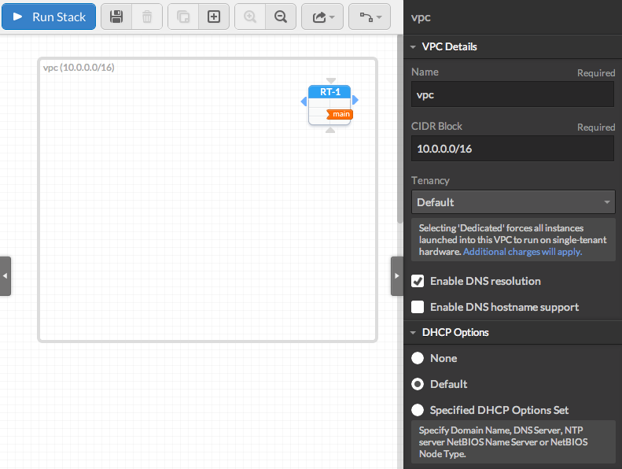
3. You can now add a new [Availability Zone](http://docs.aws.amazon.com/AWSEC2/latest/UserGuide/using-regions-availability-zones.html) of your choice by drag-n-drop it from the left pannel: 
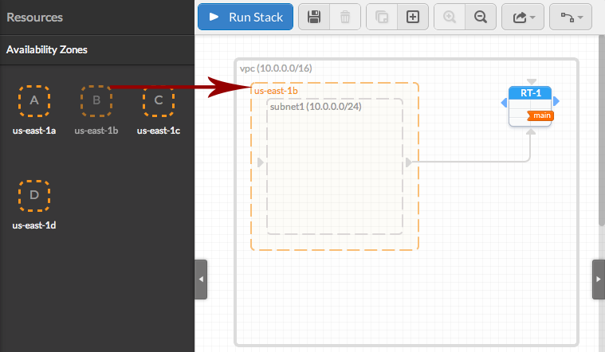
4. When adding a new Availability Zone, a default [subnet](http://docs.aws.amazon.com/AmazonVPC/latest/UserGuide/VPC_Subnets.html) is created. 
You can edit the subnet properties in the right pannel: 
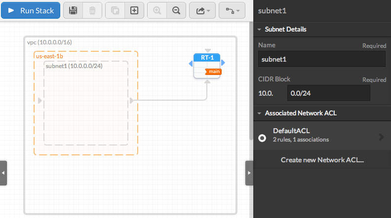 
Note that all Subnets are automatically connected to the Main Route Table. Subnets must be connected to only one Route Table.
5. Add an [Internet Gateway](http://docs.aws.amazon.com/AmazonVPC/latest/UserGuide/VPC_Internet_Gateway.html) and connect it to the Route Table 
Drag an IGW from the resource panel (VPC category) to anywhere within the VPC. Note that the IGW will automatically snap to the left edge of the VPC and you can only have one IGW per VPC. 
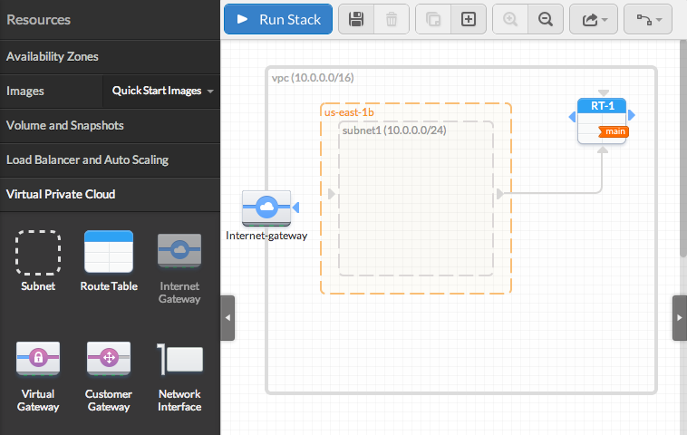 
6. You can now drag from the blue ports on the Route Table to the blue incoming port on the IGW to connect it. 
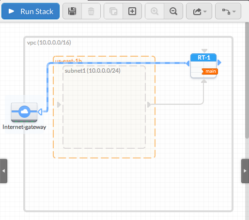 
7. You can edit the Route Table properties to define routing rules on the right pannel after selecting it. Note that when you connect an RT to an IGW we will automatically add a destination "0.0.0.0/0" rule. 
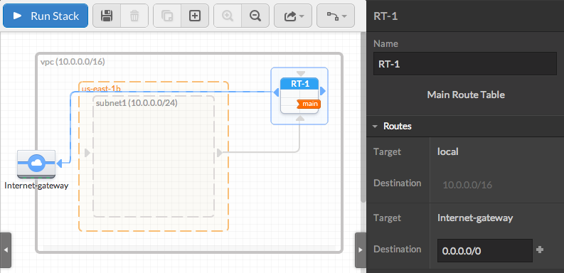 

#### Optionally
You can stop there and save the Stack as a networking template or we can continue and launch it as an App.

1. Add an AMI to a Subnet 
We can now drag on an AMI from the resource panel to inside the Subnet in our VPC. 
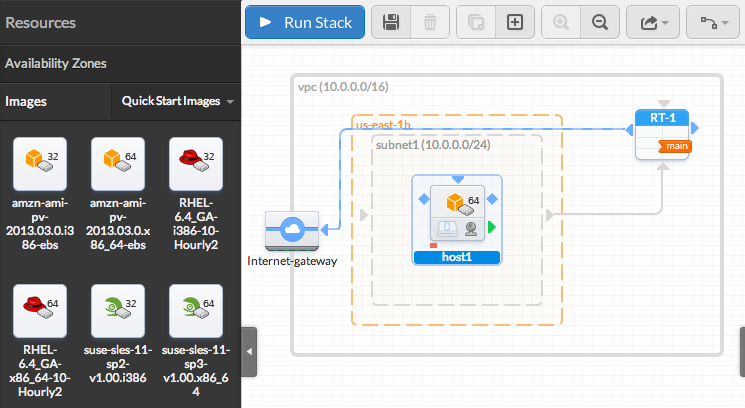 
2. Assign a public address to the instance. 
 
3. [OR] Add an [Elastic IP](http://docs.aws.amazon.com/AWSEC2/latest/UserGuide/elastic-ip-addresses-eip.html) 
Next click on the bottom-right icon of the instance to attach an EIP. 
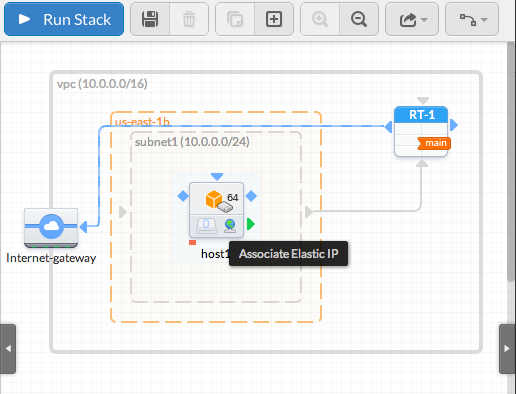 

Your VPC is now configured. Please, have a look at the [Part 1 - Basics and quick start](#basics-and-quick-start) tutorial to get more information about App creation.

### 2.2 - VPC with Public and Private Subnets
[Description](http://docs.aws.amazon.com/AmazonVPC/latest/UserGuide/VPC_Scenario2.html): "The configuration for this scenario includes a virtual private cloud (VPC) with a public subnet and a private subnet. The instances in the public subnet can receive inbound traffic directly from the Internet, whereas the instances in the private subnet can't. The instances in the public subnet can send outbound traffic directly to the Internet, whereas the instances in the private subnet can't. Instead, the instances in the private subnet can access the Internet by using a network address translation (NAT) instance that you launch into the public subnet."

The following diagram shows what we will create in this example: 
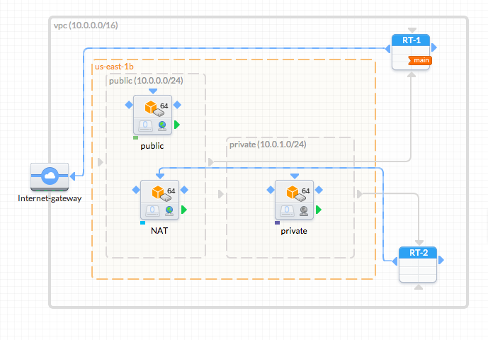 

Step by Step guide to configuring a VPC with Public and Private Subnets (you may want to have a look at the [VPC Mode - VPC with a Public Subnet Only - Part 2 - 2.1](#vpc-with-a-public-subnet-only) tutorial first, before creating this VPC.

1. Create a new VPC Stack, in the region of your choice: 
 
2. A default VPC is created when you create a new VPC Stack, as well as a default [Route Table](http://docs.aws.amazon.com/AmazonVPC/latest/UserGuide/VPC_Route_Tables.html). 
You can optionaly edit the subnet details in the right pannel (don't forget to focus on the subnet by clicking on its blank area). The network address must be written following the [CIDR](http://en.wikipedia.org/wiki/Classless_Inter-Domain_Routing) notation: 

3. You can now add a new [Availability Zone](http://docs.aws.amazon.com/AWSEC2/latest/UserGuide/using-regions-availability-zones.html) of your choice by drag-n-drop it from the left pannel: 

4. When adding a new Availability Zone, a default [subnet](http://docs.aws.amazon.com/AmazonVPC/latest/UserGuide/VPC_Subnets.html) is created. 
You can edit the subnet properties in the right pannel 
 
Note that all Subnets are automatically connected to the Main Route Table. Subnets must be connected to only one Route Table.
5. Add another subnet by dragging it from the resources pannel and dropping it in the Availability Zone. 
Name one subnet "public" with the CIDR IP "10.0.0.0/24" and the other "private" with the CIDR IP "10.0.1.0/24" as following: 
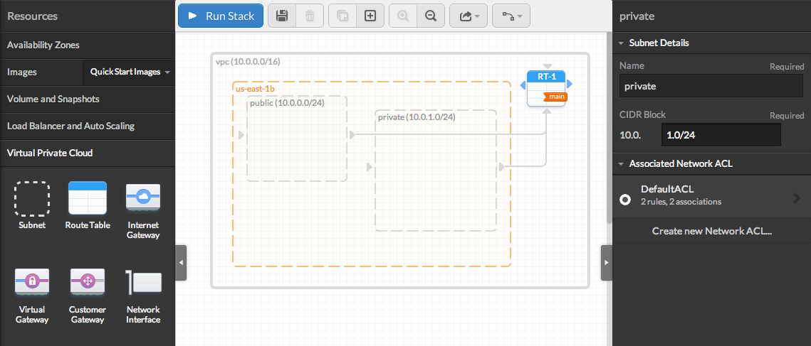 
6. Add an [Internet Gateway](http://docs.aws.amazon.com/AmazonVPC/latest/UserGuide/VPC_Internet_Gateway.html) and connect it to the Route Table 
Drag an IGW from the resource panel (VPC category) to anywhere within the VPC. Note that the IGW will automatically snap to the left edge of the VPC and you can only have one IGW per VPC. 
Then, drag from the blue ports on the Route Table to the blue incoming port on the IGW to connect it. 
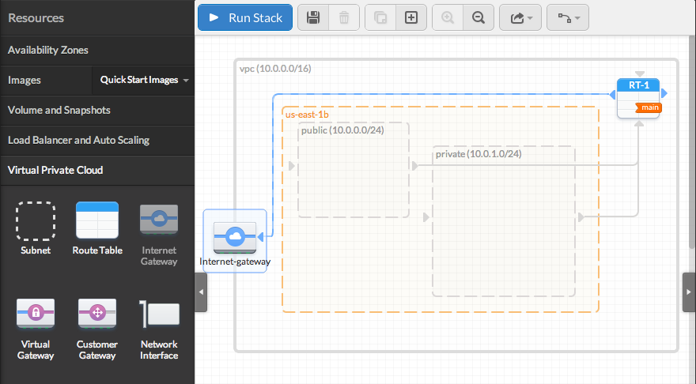 
7. You can click on the Route Table to define routing rules. Note that when you connect an RT to an IGW we will automatically add a destination "0.0.0.0/0" rule. 
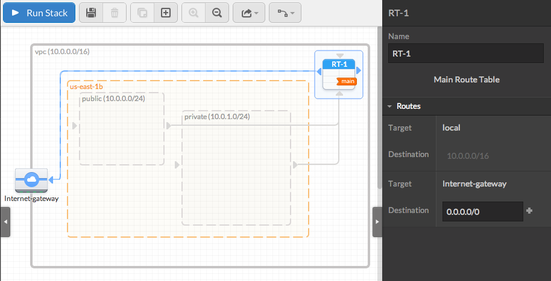 
8. Add another Route Table 
Drag another RT from the resource panel to anywhere in the VPC. We can then associate subnet "private" to this RT by dragging from the grey port on the right of the subnet to an incoming grey port on the RT. Note that, as subnets can only be associated with one RT, the previous association will automatically be removed. 
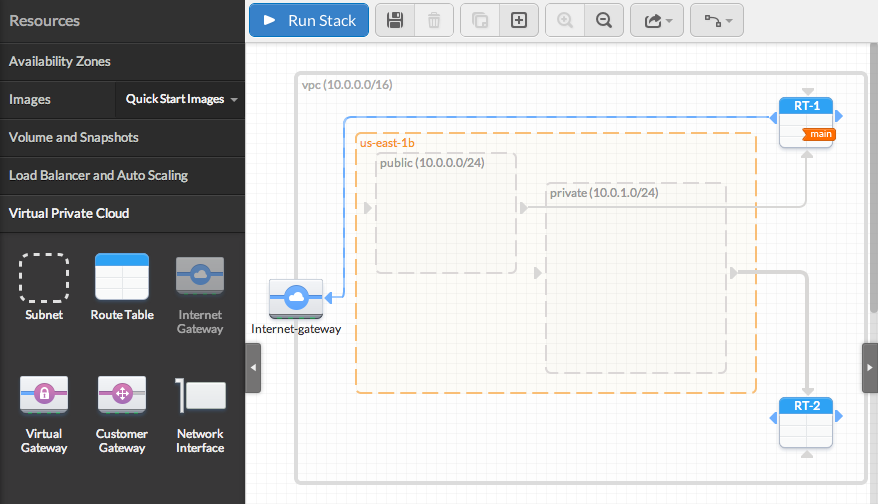 
9. Add the AMIs to the Subnets 
We can now drag on some AMIs from the resource panel to inside the Subnets in our VPC.  
Let's start by dragging two 64 bit Amazon Linux AMIs, one to each subnet. Optionally, click on the instances to rename the hosts in the right pannel. 
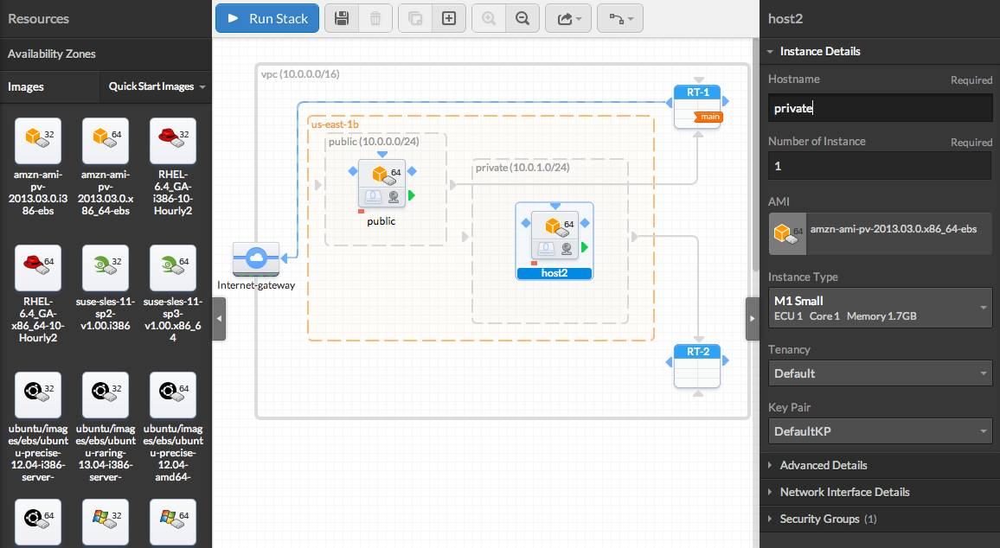  
Also add a NAT instance to the "public" subnet. You can find a Amazon Linux NAT AMI in the Quickstart AMIs. Drag it to the public subnet and name it "NAT". 
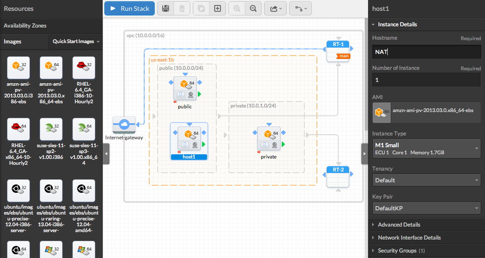
10. Connect the NAT and configure the RT 
Connect the RT to the NAT AMI by dragging from its outgoing blue port to the incoming blue port on the left of the NAT AMI.  
Enter "0.0.0.0/0" as "Destination" in the right pannel. 
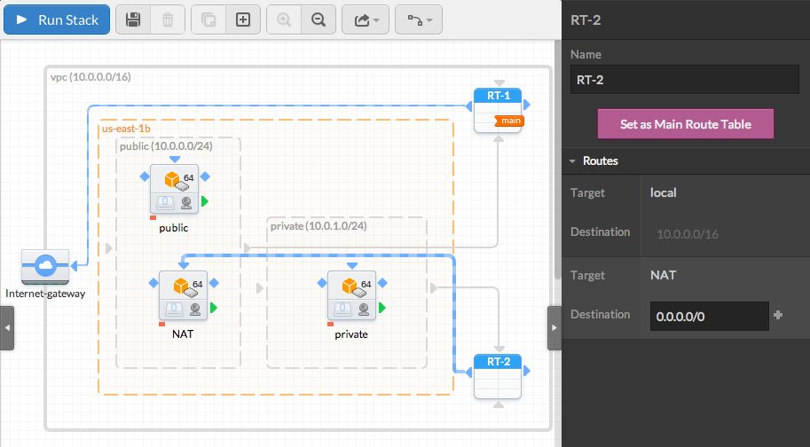
11. Configure the AMI IPs 
Click an AMI and select "Network Interface Details" in the right pannel. Here you can manually specify the IP address within the subnet range (".x" means auto assign random IP) and click the icon on the right to add an Elastic IP to a private IP. 
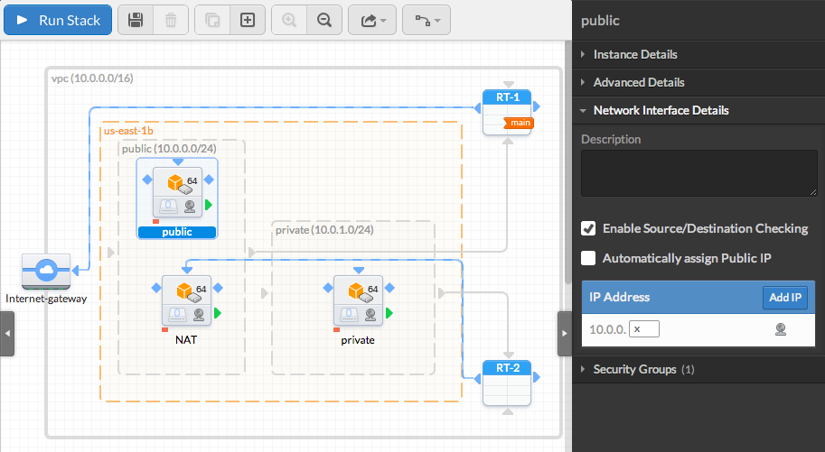 
Go ahead and use the following IP configurations: <table>
<tbody><tr><th>Subnet</th>
<th>Host</th>
<th>Private IP</th>
<th>Elastic IP</th>
</tr><tr><td>public</td>
<td>NAT</td>
<td>10.0.0.x</td>
<td>Yes</td>
</tr><tr><td>public</td>
<td>public</td>
<td>10.0.0.5</td>
<td>Yes</td>
</tr><tr><td>private</td>
<td>private</td>
<td>10.0.1.5</td>
<td>No</td>
</tr></tbody>
</table> 
12. Create and Configure Security Groups for each AMI 
Click an AMI and select "Security Groups" on the right pannel. Here you can create some new Security groups.  
Configure the Security Groups as following: <table><tbody><tr><th>AMI</th>
<th>SG Name</th>
</tr><tr><td>NAT</td>
<td>NATSG</td>
</tr><tr><td>public</td>
<td>WebServerSG</td>
</tr><tr><td>private</td>
<td>DBServerSG</td>
</tr></tbody></table>
You can now add the following rules to the Security Groups (see the [Part 1 - Basics and quick start](#basics-and-quick-start) tutorial before to know how to create Security Rules): <table><tbody><tr><td rowspan="2">SG</td>
<td rowspan="2">AMI</td>
<td colspan="4">Security Group Rules</td>
</tr><tr style="border-bottom: 1px solid gray;"><td>In / Out</td>
<td>Soure / Dest</td>
<td>Protocol</td>
<td>Port Range</td>
</tr><tr><td rowspan="8">WebServerSG</td>
<td rowspan="8">public</td>
<td rowspan="4" style="border-left: 1px solid gray;">In</td>
<td>0.0.0.0/0</td>
<td>TCP</td>
<td>80</td>
</tr><tr><td>0.0.0.0/0</td>
<td>TCP</td>
<td>443</td>
</tr><tr><td>Your network’s public IP address range</td>
<td>TCP</td>
<td>22</td>
</tr><tr style="border-bottom: 1px solid gray;"><td>Your network’s public IP address range</td>
<td>TCP</td>
<td>3389</td>
</tr><tr><td rowspan="4" style="border-left: 1px solid gray;">Out</td>
<td>0.0.0.0/0</td>
<td>TCP</td>
<td>80</td>
</tr><tr><td>0.0.0.0/0</td>
<td>TCP</td>
<td>443</td>
</tr><tr><td>private.private_ip_address</td>
<td>TCP</td>
<td>1433</td>
</tr><tr style="border-bottom: 1px solid gray;"><td>private.private_ip_address</td>
<td>TCP</td>
<td>3306</td>
</tr><tr><td rowspan="4">DBServerSG</td>
<td rowspan="4">private</td>
<td rowspan="2" style="border-left: 1px solid gray;">In</td>
<td>public.private_ip_address</td>
<td>TCP</td>
<td>1433</td>
</tr><tr style="border-bottom: 1px solid gray;"><td>public.private_ip_address</td>
<td>TCP</td>
<td>3306</td>
</tr><tr><td rowspan="2" style="border-left: 1px solid gray;">Out</td>
<td>0.0.0.0/0</td>
<td>TCP</td>
<td>80</td>
</tr><tr style="border-bottom: 1px solid gray;"><td>0.0.0.0/0</td>
<td>TCP</td>
<td>443</td>
</tr><tr><td rowspan="5">NATSG</td>
<td rowspan="5">NAT</td>
<td rowspan="3" style="border-left: 1px solid gray;">In</td>
<td>10.0.1.0/24</td>
<td>TCP</td>
<td>80</td>
</tr><tr><td>10.0.1.0/24</td>
<td>TCP</td>
<td>443</td>
</tr><tr style="border-bottom: 1px solid gray;"><td>Your network’s public IP address range</td>
<td>TCP</td>
<td>22</td>
</tr><tr><td rowspan="2" style="border-left: 1px solid gray;">Out</td>
<td>0.0.0.0/0</td>
<td>TCP</td>
<td>80</td>
</tr><tr><td>0.0.0.0/0</td>
<td>TCP</td>
<td>443</td>
</tr></tbody></table>

### 2.3 - VPC with Public and Private Subnets and Hardware VPN Access
[Description](http://docs.aws.amazon.com/AmazonVPC/latest/UserGuide/VPC_Scenario3.html): “The configuration for this scenario includes a virtual private cloud (VPC) with a public subnet and a private subnet, and a virtual private gateway to enable communication with your own network over an IPsec VPN tunnel. We recommend this scenario if you want to extend your network into the cloud and also directly access the Internet from your VPC. This scenario enables you to run a multi-tiered application with a scalable web front end in a public subnet, and to house your data in a private subnet that is connected to your network by an IPsec VPN connection.”

The following diagram shows what we will create in this example: 
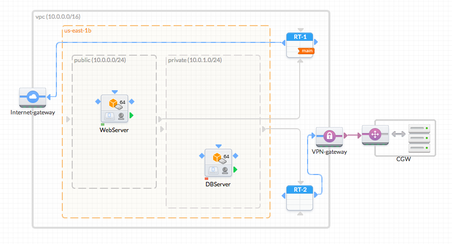 

Step by Step guide to configuring a VPC with Public Subnet and Private Subnets and Hardware VPN Access (you may want to have a look at the [VPC Mode - VPC with Public and Private Subnets - Part 2 - 2.2](#vpc-with-public-and-private-subnets) tutorial first, before creating this VPC.

1. Create a new VPC Stack, in the region of your choice: 
 
2. A default VPC is created when you create a new VPC Stack, as well as a default [Route Table](http://docs.aws.amazon.com/AmazonVPC/latest/UserGuide/VPC_Route_Tables.html). 
You can optionaly edit the subnet details in the right pannel (don't forget to focus on the subnet by clicking on its blank area). The network address must be written following the [CIDR](http://en.wikipedia.org/wiki/Classless_Inter-Domain_Routing) notation: 

3. You can now add a new [Availability Zone](http://docs.aws.amazon.com/AWSEC2/latest/UserGuide/using-regions-availability-zones.html) of your choice by drag-n-drop it from the left pannel: 

4. When adding a new Availability Zone, a default [subnet](http://docs.aws.amazon.com/AmazonVPC/latest/UserGuide/VPC_Subnets.html) is created. 
You can edit the subnet properties in the right pannel 
 
Note that all Subnets are automatically connected to the Main Route Table. Subnets must be connected to only one Route Table.
5. Add another subnet by dragging it from the resources pannel and dropping it in the Availability Zone. 
Name one subnet "public" with the CIDR IP "10.0.0.0/24" and the other "private" with the CIDR IP "10.0.1.0/24" as following: 
 
6. Add an [Internet Gateway](http://docs.aws.amazon.com/AmazonVPC/latest/UserGuide/VPC_Internet_Gateway.html) and connect it to the Route Table 
Drag an IGW from the resource panel (VPC category) to anywhere within the VPC. Note that the IGW will automatically snap to the left edge of the VPC and you can only have one IGW per VPC. 
Then, drag from the blue ports on the Route Table to the blue incoming port on the IGW to connect it. 
 
7. You can click on the Route Table to define routing rules. Note that when you connect an RT to an IGW we will automatically add a destination "0.0.0.0/0" rule. 
 
8. Add another Route Table 
Drag another RT from the resource panel to anywhere in the VPC. We can then associate subnet "private" to this RT by dragging from the grey port on the right of the subnet to an incoming grey port on the RT. Note that, as subnets can only be associated with one RT, the previous association will automatically be removed. 
 
9. Add a [Virtual Private Gateway](http://docs.aws.amazon.com/AmazonVPC/latest/UserGuide/VPC_VPN.html) and Connect it to the Route Table 
Drag a VGW in to the VPC. Note that it will snap to the right side of the VPC. Once added, connect the left blue port of the VGW to the blue incoming port of the RT associated with the Private subnet. The RT configuration dialogue will automatically appear. Enter the Destination "172.16.0.0/12" in the right pannel. 
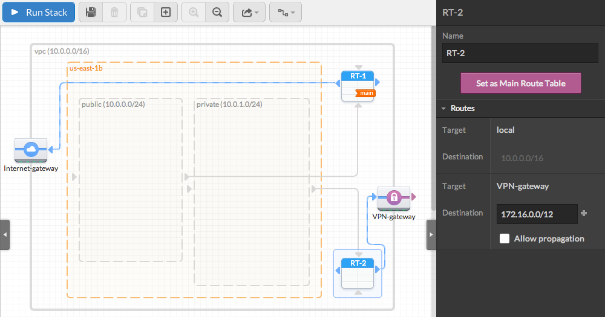 
10. Add a [Customer Gateway](http://docs.aws.amazon.com/AmazonVPC/latest/NetworkAdminGuide/Introduction.html) 
Drag a CGW to the canvas. Note that it must be outside the VPC. After have added the CGW you must enter the IP address of your CGW, e.g., "203.0.113.12". You can rename it as you wish. 
 
11. Connect the CGW and VGW with a VPN Connection 
Connect the purple ports of the VGW and CGW to create a VPN. You must enter your VPN CIDR, e.g., "172.16.0.0/24", in the right pannel. 
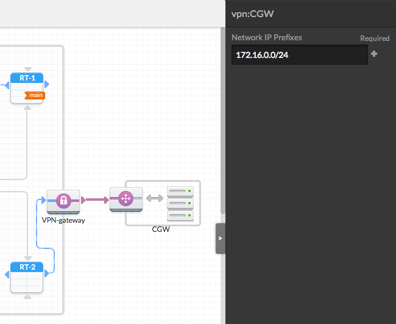 
12. Add AMIs to the Subnets 
Drag in some AMIs to the Subnets and rename them. 
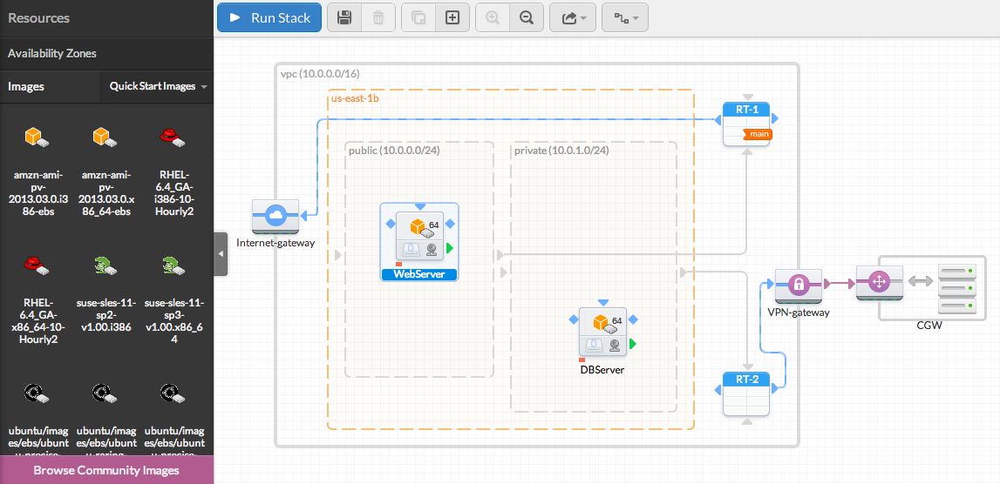 
13. Create and Configure Security Groups for each AMI 
Click an AMI and select "Security Groups" in the right pannel. Here you can create a custom SG for each AMI and remove them from "Default SG". 
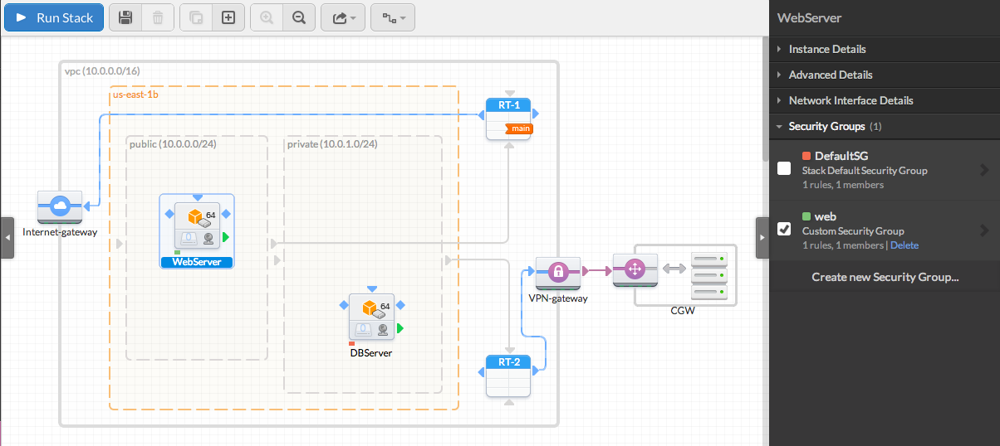 
14. Connect the AMIs and Configure the Security Groups 
You can define the Security Rules in each SG properties.  
Define it as follow: <table><tbody><tr><td rowspan="2">SG</td>
<td rowspan="2">AMI</td>
<td colspan="4">Security Group Rules</td>
</tr><tr style="border-bottom: 1px solid gray;"><td>In / Out</td>
<td>Soure / Dest</td>
<td>Protocol</td>
<td>Port Range</td>
</tr><tr><td rowspan="8">WebServerSG</td>
<td rowspan="8">WebServer</td>
<td rowspan="4" style="border-left: 1px solid gray;">In</td>
<td>0.0.0.0/0</td>
<td>TCP</td>
<td>80</td>
</tr><tr><td>0.0.0.0/0</td>
<td>TCP</td>
<td>443</td>
</tr><tr><td>Your network’s public IP address range</td>
<td>TCP</td>
<td>22</td>
</tr><tr style="border-bottom: 1px solid gray;"><td>Your network’s public IP address range</td>
<td>TCP</td>
<td>3389</td>
</tr><tr><td rowspan="4" style="border-left: 1px solid gray;">Out</td>
<td>0.0.0.0/0</td>
<td>TCP</td>
<td>80</td>
</tr><tr><td>0.0.0.0/0</td>
<td>TCP</td>
<td>443</td>
</tr><tr><td>DBServer.private_ip_address</td>
<td>TCP</td>
<td>1433</td>
</tr><tr style="border-bottom: 1px solid gray;"><td>DBServer.private_ip_address</td>
<td>TCP</td>
<td>3306</td>
</tr><tr><td rowspan="6">DBServerSG</td>
<td rowspan="6">DBServer</td>
<td rowspan="4" style="border-left: 1px solid gray;">In</td>
<td>WebServer.private_ip_address</td>
<td>TCP</td>
<td>1433</td>
</tr><tr><td>WebServer.private_ip_address</td>
<td>TCP</td>
<td>3306</td>
</tr><tr><td>172.16.0.0/24</td>
<td>TCP</td>
<td>22</td>
</tr><tr style="border-bottom: 1px solid gray;"><td>172.16.0.0/24</td>
<td>TCP</td>
<td>3389</td>
</tr><tr><td rowspan="2" style="border-left: 1px solid gray;">Out</td>
<td>0.0.0.0/0</td>
<td>TCP</td>
<td>80</td>
</tr><tr><td>0.0.0.0/0</td>
<td>TCP</td>
<td>443</td>
</tr></tbody></table>
15. Configure DHCP Options Set 
You can edit the VPC properties to configure DHCP in the right pannel. 
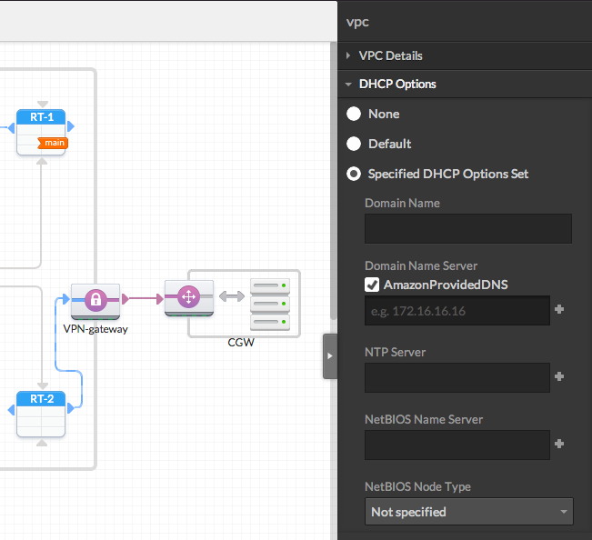

### 2.4 - VPC with a Private Subnet Only and Hardware VPN Access
[Description](http://docs.aws.amazon.com/AmazonVPC/latest/UserGuide/VPC_Scenario4.html): “The configuration for this scenario includes a virtual private cloud (VPC) with a single private subnet, and a virtual private gateway to enable communication with your own network over an IPsec VPN tunnel. There is no Internet gateway to enable communication over the Internet. We recommend this scenario if you want to extend your network into the cloud using Amazon's infrastructure without exposing your network to the Internet.”

The following diagram shows what we will create in this example: 
 

Step by Step guide to configuring a VPC with a Private Subnet Only and Hardware VPN Access (you may want to have a look at the [VPC Mode - VPC with Public and Private Subnets and Hardware VPN Access - Part 2 - 2.3](#vpc-with-public-and-private-subnets-and-hardware-vpn-access) tutorial first, before creating this VPC.

1. Create a new VPC Stack, in the region of your choice: 
 
2. A default VPC is created when you create a new VPC Stack, as well as a default [Route Table](http://docs.aws.amazon.com/AmazonVPC/latest/UserGuide/VPC_Route_Tables.html). 
You can optionaly edit the subnet details in the right pannel (don't forget to focus on the subnet by clicking on its blank area). The network address must be written following the [CIDR](http://en.wikipedia.org/wiki/Classless_Inter-Domain_Routing) notation: 

3. You can now add a new [Availability Zone](http://docs.aws.amazon.com/AWSEC2/latest/UserGuide/using-regions-availability-zones.html) of your choice by drag-n-drop it from the left pannel: 
 
4. When adding a new Availability Zone, a default [subnet](http://docs.aws.amazon.com/AmazonVPC/latest/UserGuide/VPC_Subnets.html) is created. 
You can edit the subnet properties in the right pannel: 
 
Note that all Subnets are automatically connected to the Main Route Table. Subnets must be connected to only one Route Table.
5. Add a Virtual Private Gateway and Connect it to the Route Table 
Drag a VGW in to the VPC. Note that it will snap to the right side of the VPC. Once added, connect the left blue port of the VGW to the blue incoming port of the RT. Then, enter the Destination "0.0.0.0/0" in the right pannel. 
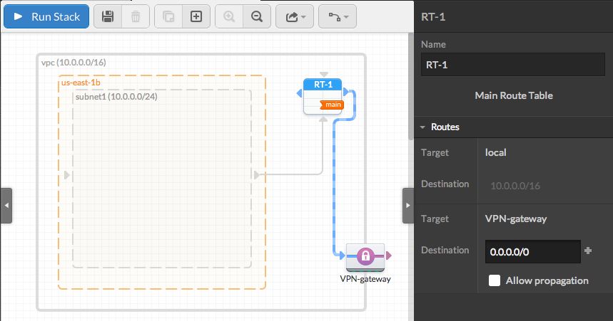 
6. Add a [Customer Gateway](http://docs.aws.amazon.com/AmazonVPC/latest/NetworkAdminGuide/Introduction.html) 
Drag a CGW to the canvas. Note that it must be outside the VPC. After have added the CGW you must enter the IP address of your CGW, e.g., "203.0.113.12". You can rename it as you wish. 
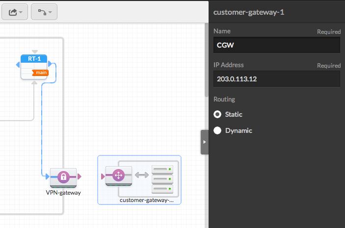 
7. Connect the CGW and VGW with a VPN Connection 
Connect the purple ports of the VGW and CGW to create a VPN. You must enter your VPN CIDR, e.g., "172.16.0.0/24", in the right pannel. 
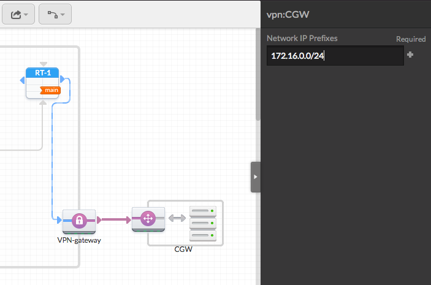 